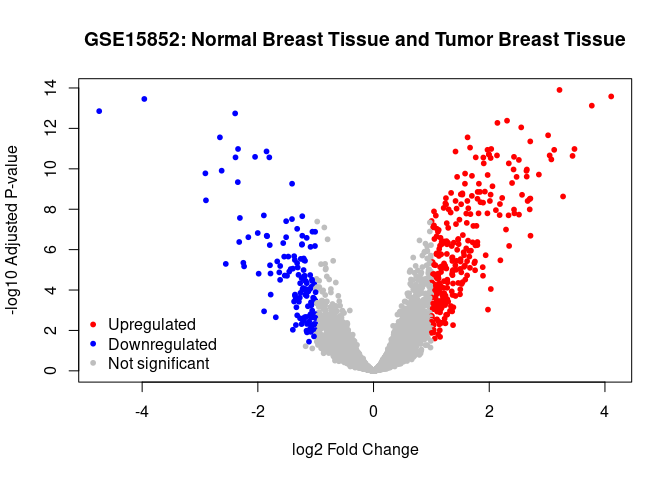
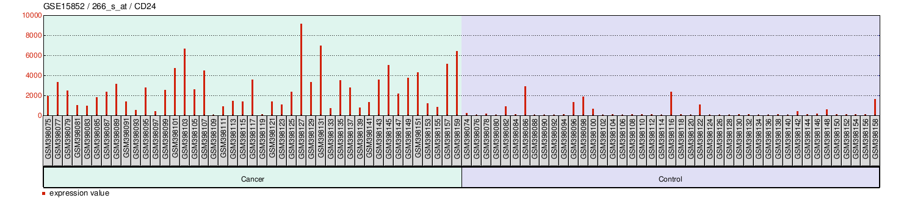

Indepentent RMarkdown Portfolio – Affects of TP53 Mutations on Rates of
Breast Cancer
================
William Franson
2025-12-05

- [ABSTRACT](#abstract)
- [BACKGROUND](#background)
- [STUDY QUESTION and HYPOTHESIS](#study-question-and-hypothesis)
  - [Question](#question)
  - [Hypothesis](#hypothesis)
  - [Prediction](#prediction)
- [METHODS/GRAPHS/RESULTS](#methodsgraphsresults)
- [DISCUSSION](#discussion)
- [CONCLUSION](#conclusion)
- [REFERENCES](#references)

# ABSTRACT

Cancer occurs when the division of a cell becomes uncontrolled in the
human body leading to an overgrowth of nonfunctional tissue that saps
the body of necessary resources. What causes the uncontrolled growth
varies but is often a mutation in a gene that controls the cell cycle or
closely related function such as cell adhesion or signaling. One such
gene CD24 is thought to be a gene that when mutated can cause cancer in
breast tissue. In this paper we looked at the GSE15852 data set to
compare expression rates of CD24 in healthy and cancerous tissue. What
we found was an increased rate in expression in cancerous tissues
although not a perfect trend.

# BACKGROUND

An estimated 600,000 Americans are expected to die of various cancers in
2025 and is one of the leading causes of death in the United States
(American Cancer Society 2025) By better understanding the causes of
cancers we can prevent the arduous treatment processes and thousands of
deaths a year. Biologically cancer is caused by the rapid and
uncontrolled growth of cells in the human body and is caused by a
failure of various regulatory stages in the cell division cycle. These
failures are often caused by genetic mutations that cause over or under
expression of regulatory proteins that play important rolls in the cell
cycle. One highly notable important protein is the tumor suppressor
protein 53 (TP53) which codes for cell repair and apoptosis (Surget
2013). For the purposes of this study we will be analyzing the protein
CD24, a protein that functions in cell adhesion, via the GSE15852 data
set.

# STUDY QUESTION and HYPOTHESIS

## Question

Whether expression rates of CD24 are linked to rates of breast cancer.

## Hypothesis

That the expression rates of CD24 can be used to predict whether breast
cancer.

## Prediction

Over expression of CD24 will be linked to higher rates of breast cancer.

# METHODS/GRAPHS/RESULTS

We used the GSE15852 data set for the analysis. This is a set of data
collected by Bong et al., 2009, in which they took samples from 43
healthy breast tissue and 43 cancerous breast tissue and determined
rates of expression for various genes including CD24 the gene we are
looking at. The data was analysed via GEOquery functions in R studio.
Samples were divided into control and cancer groups and charted based on
their expression rates. A Bonferroni multiple test correction was
utilized in order to account for any false positives in the data
yielding a more accurate adjusted p-value. Another chart was generated
that took the adjusted p-values for any given gene and plotted it
against the log2 change in expression rates.

``` r
# Version info: R 4.2.2, Biobase 2.58.0, GEOquery 2.66.0, limma 3.54.0
################################################################
#   Data plots for selected GEO samples
library(GEOquery)
```

    ## Loading required package: Biobase

    ## Loading required package: BiocGenerics

    ## 
    ## Attaching package: 'BiocGenerics'

    ## The following objects are masked from 'package:stats':
    ## 
    ##     IQR, mad, sd, var, xtabs

    ## The following objects are masked from 'package:base':
    ## 
    ##     anyDuplicated, aperm, append, as.data.frame, basename, cbind,
    ##     colnames, dirname, do.call, duplicated, eval, evalq, Filter, Find,
    ##     get, grep, grepl, intersect, is.unsorted, lapply, Map, mapply,
    ##     match, mget, order, paste, pmax, pmax.int, pmin, pmin.int,
    ##     Position, rank, rbind, Reduce, rownames, sapply, setdiff, sort,
    ##     table, tapply, union, unique, unsplit, which.max, which.min

    ## Welcome to Bioconductor
    ## 
    ##     Vignettes contain introductory material; view with
    ##     'browseVignettes()'. To cite Bioconductor, see
    ##     'citation("Biobase")', and for packages 'citation("pkgname")'.

    ## Setting options('download.file.method.GEOquery'='auto')

    ## Setting options('GEOquery.inmemory.gpl'=FALSE)

``` r
library(limma)
```

    ## 
    ## Attaching package: 'limma'

    ## The following object is masked from 'package:BiocGenerics':
    ## 
    ##     plotMA

``` r
library(umap)

# load series and platform data from GEO

gset <- getGEO("GSE15852", GSEMatrix =TRUE, AnnotGPL=TRUE)
```

    ## Found 1 file(s)

    ## GSE15852_series_matrix.txt.gz

``` r
if (length(gset) > 1) idx <- grep("GPL96", attr(gset, "names")) else idx <- 1
gset <- gset[[idx]]

# make proper column names to match toptable 
fvarLabels(gset) <- make.names(fvarLabels(gset))

# group membership for all samples
gsms <- paste0("01010101010101010101010101010101010101010101010101",
               "010101010101010101010101010101010101")
sml <- strsplit(gsms, split="")[[1]]

# log2 transformation
ex <- exprs(gset)
qx <- as.numeric(quantile(ex, c(0., 0.25, 0.5, 0.75, 0.99, 1.0), na.rm=T))
LogC <- (qx[5] > 100) ||
  (qx[6]-qx[1] > 50 && qx[2] > 0)
if (LogC) { ex[which(ex <= 0)] <- NaN
exprs(gset) <- log2(ex) }

# assign samples to groups and set up design matrix
gs <- factor(sml)
groups <- make.names(c("Normal Breast Tissue","Tumor Breast Tissue"))
levels(gs) <- groups
gset$group <- gs
design <- model.matrix(~group + 0, gset)
colnames(design) <- levels(gs)

gset <- gset[complete.cases(exprs(gset)), ] # skip missing values

fit <- lmFit(gset, design)  # fit linear model

# set up contrasts of interest and recalculate model coefficients
cts <- paste(groups[1], groups[2], sep="-")
cont.matrix <- makeContrasts(contrasts=cts, levels=design)
fit2 <- contrasts.fit(fit, cont.matrix)

# compute statistics and table of top significant genes
fit2 <- eBayes(fit2, 0.01)
tT <- topTable(fit2, adjust="fdr", sort.by="B", number=250)

tT <- subset(tT, select=c("ID","adj.P.Val","P.Value","t","B","logFC","Gene.symbol","Gene.title","Gene.ID"))

# Visualize and quality control test results.
# Build histogram of P-values for all genes. Normal test
# assumption is that most genes are not differentially expressed.
tT2 <- topTable(fit2, adjust="fdr", sort.by="B", number=Inf)

# summarize test results as "up", "down" or "not expressed"
dT <- decideTests(fit2, adjust.method="fdr", p.value=0.05, lfc=0)

# Volcano plot (log P-value vs log fold change)
colnames(fit2) # list contrast names
```

    ## [1] "Normal.Breast.Tissue-Tumor.Breast.Tissue"

``` r
ct <- 1  # choose contrast of interest
dT <- topTable(fit2, coef = ct, number = Inf, adjust.method = "BH")

# Define thresholds
logFC_cutoff <- 1
adjP_cutoff <- 0.05

# Assign colors based on thresholds
dT$color <- "grey"  # default
dT$color[dT$logFC >  logFC_cutoff & dT$adj.P.Val < adjP_cutoff] <- "red"    # upregulated
dT$color[dT$logFC < -logFC_cutoff & dT$adj.P.Val < adjP_cutoff] <- "blue"   # downregulated

# Clean up the contrast name (remove periods)
contrast_name <- gsub("\\.", " ", colnames(fit2)[ct])
contrast_name <- gsub("-", " and ", contrast_name)

# Draw volcano plot
with(dT, plot(logFC, -log10(adj.P.Val),
              pch = 20,
              col = color,
              main = paste("GSE15852:", contrast_name),
              xlab = "log2 Fold Change",
              ylab = "-log10 Adjusted P-value"))

# Add legend
legend("bottomleft",
       legend = c("Upregulated", "Downregulated", "Not significant"),
       col = c("red", "blue", "grey"),
       pch = 20,
       bty = "n")
```

<!-- -->

``` r

```


# DISCUSSION

We predicted that as CD24 expression rates rose the tissue it was taken
from would be more likely to be cancerous and that is supported by the
data we looked at. In the second graph, the bar plot, we can see a clear
difference between the levels of CD24 expression between the cancerous
tissue on the left in the teal with higher bars and thus higher rates of
expression when compared to the normal tissue on the right in the
purple. The adjusted p-value for this graph was 1.05E-13 indicating a
strong statistical significance. There is some variation however and
multiple normal tissues have higher rates of CD24 expression than the
lowest cancer tissues indicating that it is not a perfect predictor.
This is corroborated by the first graph, the volcano plot, which
displays the relationship between regulation and expression across many
genes. As you can see it is not the case that all genes follow this
trend of over expression = cancer and even among those that see an
increase with a change in expression the change is not equal.

# CONCLUSION

The biology and genetics of cancer is a complicated topic that is
affected by a wide variety of factors. The expression rates of certain
genes is certainly an important one of these factors and can serve as a
useful starting point for cancer research. Over-expression of CD24 is
correlated to increased rates of breast cancer although it is not a
perfect predictor.

# REFERENCES

1.  Bong I, Ni P, Zakaria Z, Muhammad R, Abdullah N, Ibrahim N, Emran
    NA, Abdullah NH & Hussain SN (2009). Expression data from human
    breast tumors and their paired normal tissues \[Data set\]. NCBI
    Gene Expression Omnibus.
    <https://www.ncbi.nlm.nih.gov/geo/query/acc.cgi?acc=GSE15852>

2.  ChatGPT. OpenAI, version Jan 2025. Used as a reference for functions
    such as plot() and to correct syntax errors. Accessed 2025-12-05.

3.  Cancer facts & figures 2025. American Cancer Society. (n.d.).
    <https://www.cancer.org/content/dam/cancer-org/research/cancer-facts-and-statistics/annual-cancer-facts-and-figures/2025/2025-cancer-facts-and-figures-acs.pdf>

4.  Surget, S., Khoury, M. P., & Bourdon, J. C. (2013). Uncovering the
    role of p53 splice variants in human malignancy: a clinical
    perspective. OncoTargets and therapy, 7, 57–68.
    <https://doi.org/10.2147/OTT.S53876>
