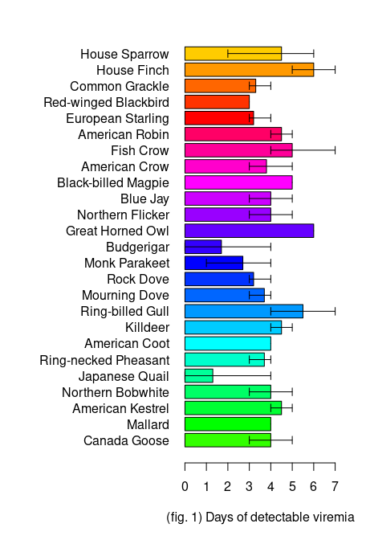
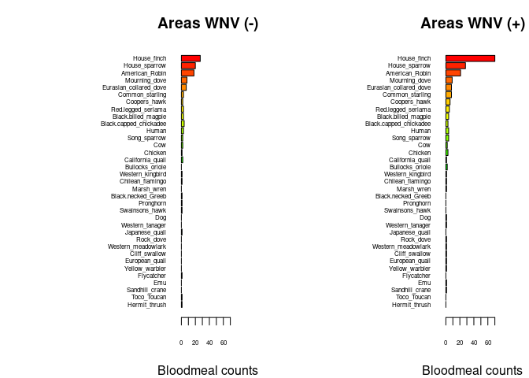

Warm-up mini-Report: Mosquito Blood Hosts in Salt Lake City, Utah
================
William Franson
2025-10-10

- [ABSTRACT](#abstract)
- [BACKGROUND](#background)
- [STUDY QUESTION and HYPOTHESIS](#study-question-and-hypothesis)
  - [Questions](#questions)
  - [Hypothesis](#hypothesis)
  - [Prediction](#prediction)
- [METHODS](#methods)
  - [Fill in 1st analysis
    e.g. barplots](#fill-in-1st-analysis-eg-barplots)
  - [Fill in 2nd analysis/plot e.g. generalized linear
    model](#fill-in-2nd-analysisplot-eg-generalized-linear-model)
- [DISCUSSION](#discussion)
  - [Interpretation of 1st analysis
    (e.g. barplots)](#interpretation-of-1st-analysis-eg-barplots)
  - [Interpretation of 2nd analysis (e.g. generalized linear
    model)](#interpretation-of-2nd-analysis-eg-generalized-linear-model)
- [CONCLUSION](#conclusion)
- [REFERENCES](#references)

# ABSTRACT

As West Nile Virus (WNV) becomes more prevalent in the Western United
States, better understanding of how it spreads is vital to ensure public
health. Humans contract WNV from mosquitoes which have previously bitten
an infected bird. Whether certain birds are more likely to serve as a
reservoir species is unknown, although we suspect that the House Finch
(*Haemorhous mexicanus*) is likely to serve as a reservoir. We tested
this by collecting mosquitoes who have fed on a host and analyzed the
relationship between makeup of host species and presence of WNV at a
location. We found the presence of House Finches was a indicator of WNV
presence in an area based on the analyzes performed on captured
mosquitoes bloodmeals.

# BACKGROUND

West Nile Virus (WNV) is a disease that is transmitted from birds by
mosquito bites. After biting an infected bird a mosquito may bite
another animal and transmit the disease to them. Some species such as
humans and horses can become infected, however they won’t be able to
spread WNV, to transit the disease a high amount of virions must be
present in the blood (viremia) before a mosquito bites. Humans don’t
reach a high enough viremia level to spread the disease. Some species
however, such as the house finch, have enough virions in their blood to
transmit the disease for many days without experiencing severe symptoms,
and since they often survive the infections, an outbreak is not
immediately obvious (Komar et al. (2003)).

Since these finches are capable of storing the disease for a time
(fig. 1) while it is transferred to other individuals they are referred
to as a reservoir population. Without a reservoir population of birds
the disease can’t be transmitted to humans so better understanding the
food sources of mosquitoes in an area and whether they are capable of
being a reservoir allows us to better understand the possibility of a
mosquito being a vector for WNV. If a species is capable of serving as a
reservoir and mosquitoes do feed on them regularly we would expect to
see areas where they make up a high host percentage to correlate to the
presence of WNV in an area.

Since mosquitoes carry the blood of their host, collecting blood smears
of mosquitoes provides an easy method of determining typical hosts. By
extracting identifying the DNA present in the collected blood we are
able to determine which host a mosquito previously feed on before being
trapped. We do this by first collecting the blood from a female, as
males don’t feed on blood, which has already feed. We then extract the
DNA for analysis, however sequencing requires more DNA than is present
in a single blood smear. To fix this all samples undergo a Polymerase
Chain Reaction (PCR), a technique in which DNA samples are heated to
cause the strands to separate and then primers and polymerase are
allowed to replicate the DNA strands before being heated again to
repeate the process. This allows for a rapid increase in amount of
genetic material available for sequencing. Once sequenced the sequence
is compared to a massive database containing the sequences of thousands
of different species to find which species best matches the sample
sequence. The best match being the species from which the blood
originates and the original host for the captured mosquito.

``` r
# Manually transcribe duration (mean, lo, hi) from the last table column
duration <- data.frame(
  Bird = c("Canada Goose","Mallard", 
           "American Kestrel","Northern Bobwhite",
           "Japanese Quail","Ring-necked Pheasant",
           "American Coot","Killdeer",
           "Ring-billed Gull","Mourning Dove",
           "Rock Dove","Monk Parakeet",
           "Budgerigar","Great Horned Owl",
           "Northern Flicker","Blue Jay",
           "Black-billed Magpie","American Crow",
           "Fish Crow","American Robin",
           "European Starling","Red-winged Blackbird",
           "Common Grackle","House Finch","House Sparrow"),
  mean = c(4.0,4.0,4.5,4.0,1.3,3.7,4.0,4.5,5.5,3.7,3.2,2.7,1.7,6.0,4.0,
           4.0,5.0,3.8,5.0,4.5,3.2,3.0,3.3,6.0,4.5),
  lo   = c(3,4,4,3,0,3,4,4,4,3,3,1,0,6,3,
           3,5,3,4,4,3,3,3,5,2),
  hi   = c(5,4,5,5,4,4,4,5,7,4,4,4,4,6,5,
           5,5,5,7,5,4,3,4,7,6)
)

# Choose some colors
cols <- c(rainbow(30)[c(10:29,1:5)])  # rainbow colors

# horizontal barplot
par(mar=c(5,12,2,2))  # wider left margin for names
bp <- barplot(duration$mean, horiz=TRUE, names.arg=duration$Bird,
              las=1, col=cols, xlab="(fig. 1) Days of detectable viremia", xlim=c(0,7))

# add error bars
arrows(duration$lo, bp, duration$hi, bp,
       angle=90, code=3, length=0.05, col="black", xpd=TRUE)
```



# STUDY QUESTION and HYPOTHESIS

## Questions

We would like to better understand which bird species are most likely to
serve as an amplifying or reservoir species so that we can better
understand which areas are likely to suffer from WNV outbreaks. By doing
this mosquito abatement programs can be focused in locations where they
are most needed saving time, money, and providing more effective
control.

## Hypothesis

Due to the long time in which viremia is detectable and the abundance of
house finches in urban areas they are likely to serve as an amplifying
species for WNV.

## Prediction

In areas with a higher amount of House Finches as hosts for mosquitoes
we would also expect to find more WNV in the blood samples.

# METHODS

To collect the data used a variety of traps were placed around the Salt
Lake City area to collect female mosquitoes. Blood smears were then
taken from said mosquitoes processed via PCR, sequenced, and compared
via BLAST. We then analyzed the data to find how the numbers of
different species affected the presence of WNV.

## Fill in 1st analysis e.g. barplots

For the first analysis we compared the total number of birds found via
blood smear analysis in locations with WNV and without WNV. With the bar
plot on the left showing locations without WNV and the right showing
locations with. By plotting on two barplots, the diffences in number of
potential host species is immediately apparent.

``` r
## import counts_matrix: data.frame with column 'loc_positives' (0/1) and host columns 'host_*'
counts_matrix <- read.csv("./bloodmeal_plusWNV_for_BIOL3070.csv")

## 1) Identify host columns
host_cols <- grep("^host_", names(counts_matrix), value = TRUE)

if (length(host_cols) == 0) {
  stop("No columns matching '^host_' were found in counts_matrix.")
}

## 2) Ensure loc_positives is present and has both levels 0 and 1 where possible
counts_matrix$loc_positives <- factor(counts_matrix$loc_positives, levels = c(0, 1))

## 3) Aggregate host counts by loc_positives
agg <- stats::aggregate(
  counts_matrix[, host_cols, drop = FALSE],
  by = list(loc_positives = counts_matrix$loc_positives),
  FUN = function(x) sum(as.numeric(x), na.rm = TRUE)
)

## make sure both rows exist; if one is missing, add a zero row
need_levels <- setdiff(levels(counts_matrix$loc_positives), as.character(agg$loc_positives))
if (length(need_levels)) {
  zero_row <- as.list(rep(0, length(host_cols)))
  names(zero_row) <- host_cols
  for (lv in need_levels) {
    agg <- rbind(agg, c(lv, zero_row))
  }
  ## restore proper type
  agg$loc_positives <- factor(agg$loc_positives, levels = c("0","1"))
  ## coerce numeric host cols (they may have become character after rbind)
  for (hc in host_cols) agg[[hc]] <- as.numeric(agg[[hc]])
  agg <- agg[order(agg$loc_positives), , drop = FALSE]
}

## 4) Decide species order (overall abundance, descending)
overall <- colSums(agg[, host_cols, drop = FALSE], na.rm = TRUE)
host_order <- names(sort(overall, decreasing = TRUE))
species_labels <- rev(sub("^host_", "", host_order))  # nicer labels

## 5) Build count vectors for each panel in the SAME order
counts0 <- rev(as.numeric(agg[agg$loc_positives == 0, host_order, drop = TRUE]))
counts1 <- rev(as.numeric(agg[agg$loc_positives == 1, host_order, drop = TRUE]))

## 6) Colors: reuse your existing 'cols' if it exists and is long enough; otherwise generate
if (exists("cols") && length(cols) >= length(host_order)) {
  species_colors <- setNames(cols[seq_along(host_order)], species_labels)
} else {
  species_colors <- setNames(rainbow(length(host_order) + 10)[seq_along(host_order)], species_labels)
}

## 7) Shared x-limit for comparability
xmax <- max(c(counts0, counts1), na.rm = TRUE)
xmax <- if (is.finite(xmax)) xmax else 1
xlim_use <- c(0, xmax * 1.08)

## 8) Plot: two horizontal barplots with identical order and colors
op <- par(mfrow = c(1, 2),
          mar = c(4, 12, 3, 2),  # big left margin for species names
          xaxs = "i")           # a bit tighter axis padding

## Panel A: No WNV detected (loc_positives = 0)
barplot(height = counts0,
        names.arg = species_labels, 
        cex.names = .5,
        cex.axis = .5,
        col = rev(unname(species_colors[species_labels])),
        horiz = TRUE,
        las = 1,
        xlab = "Bloodmeal counts",
        main = "Areas WNV (-)",
        xlim = xlim_use)

## Panel B: WNV detected (loc_positives = 1)
barplot(height = counts1,
        names.arg = species_labels, 
        cex.names = .5,
        cex.axis = .5,
        col = rev(unname(species_colors[species_labels])),
        horiz = TRUE,
        las = 1,
        xlab = "Bloodmeal counts",
        main = "Areas WNV (+)",
        xlim = xlim_use)
```

<!-- -->

``` r
par(op)

## Keep the colors mapping for reuse elsewhere
host_species_colors <- species_colors
```

## Fill in 2nd analysis/plot e.g. generalized linear model

Next we ran a statistical analysis uzing a generalized linear model to
determine if a statistical difference actually existed between the areas
with and without WNV, both whether house finch presences affected if a
site had WNV-positive pools at all (binomial) and if the did were the
WNV positivity rates higher (numeric).

``` r
# second-analysis-or-plot, glm with house finch alone against binary +/_
glm1 <- glm(loc_positives ~ host_House_finch,
            data = counts_matrix,
            family = binomial)
summary(glm1)
```

    ## 
    ## Call:
    ## glm(formula = loc_positives ~ host_House_finch, family = binomial, 
    ##     data = counts_matrix)
    ## 
    ## Coefficients:
    ##                  Estimate Std. Error z value Pr(>|z|)  
    ## (Intercept)       -0.1709     0.1053  -1.622   0.1047  
    ## host_House_finch   0.3468     0.1586   2.187   0.0287 *
    ## ---
    ## Signif. codes:  0 '***' 0.001 '**' 0.01 '*' 0.05 '.' 0.1 ' ' 1
    ## 
    ## (Dispersion parameter for binomial family taken to be 1)
    ## 
    ##     Null deviance: 546.67  on 394  degrees of freedom
    ## Residual deviance: 539.69  on 393  degrees of freedom
    ## AIC: 543.69
    ## 
    ## Number of Fisher Scoring iterations: 4

``` r
#glm with house-finch alone against positivity rate
glm2 <- glm(loc_rate ~ host_House_finch,
            data = counts_matrix)
summary(glm2)
```

    ## 
    ## Call:
    ## glm(formula = loc_rate ~ host_House_finch, data = counts_matrix)
    ## 
    ## Coefficients:
    ##                  Estimate Std. Error t value Pr(>|t|)    
    ## (Intercept)      0.054861   0.006755   8.122 6.07e-15 ***
    ## host_House_finch 0.027479   0.006662   4.125 4.54e-05 ***
    ## ---
    ## Signif. codes:  0 '***' 0.001 '**' 0.01 '*' 0.05 '.' 0.1 ' ' 1
    ## 
    ## (Dispersion parameter for gaussian family taken to be 0.01689032)
    ## 
    ##     Null deviance: 6.8915  on 392  degrees of freedom
    ## Residual deviance: 6.6041  on 391  degrees of freedom
    ##   (2 observations deleted due to missingness)
    ## AIC: -484.56
    ## 
    ## Number of Fisher Scoring iterations: 2

# DISCUSSION

## Interpretation of 1st analysis (e.g. barplots)

In the bar chart a clear difference can be seen in house finch numbers
based on whether WNV is present with positive areas having over 3x the
number of House Finches found in bloodsmear tests. Meanwhile other
common backyard birds such as house sparrows, robins, doves, and
starlings have similar presences in both WNV+ and WNV- areas. This
indicates that it is not the presence of birds in general but
specifically House Finches that matters.

## Interpretation of 2nd analysis (e.g. generalized linear model)

The statistical analysis supports this observation. With positive slopes
being found for the association of House Finches and WNV rates. It was a
strong predictor for whether WNV was present (slope= 0.3468, p= 0.0287).
The correlation was weaker however when it came to predicting rates of
WNV in an area although the finding was still statistically significant
(slope= 0.02748, P= 4.54E-05).

# CONCLUSION

Based off of the fact that both analyzes support the idea that the
presence of House Finches is a reliable indicator for WNV, there is
evidence to say that House Finches do act as an amplifying species.
Based of the higher number of House Finches found at WNV+ sites in
figure 2, and based of the small but still significant correlation in
WNV rates. The low source of correlation could be due to the fact that
WNV rates can only rise so high, since at a certain point enough
individuals will have already contracted the disease and fail to pass it
on.

Other potential sources of error could be in uncontrolled factors across
the sample sites that were not accounted for ie. presence of predators
or proximity to habitats with large bird populations. Accounting for all
uncontrolled variable would be extremely difficult however and until
evidence to support alternative hypothesis is found, the presence of
potential host species remains the best explanation.

# REFERENCES

1.  Komar N, Langevin S, Hinten S, Nemeth N, Edwards E, Hettler D, Davis
    B, Bowen R, Bunning M. Experimental infection of North American
    birds with the New York 1999 strain of West Nile virus. Emerg Infect
    Dis. 2003 Mar;9(3):311-22. <https://doi.org/10.3201/eid0903.020628>

2.  ChatGPT. OpenAI, version Jan 2025. Used as a reference for functions
    such as plot() and to correct syntax errors. Accessed 2025-10-10.
